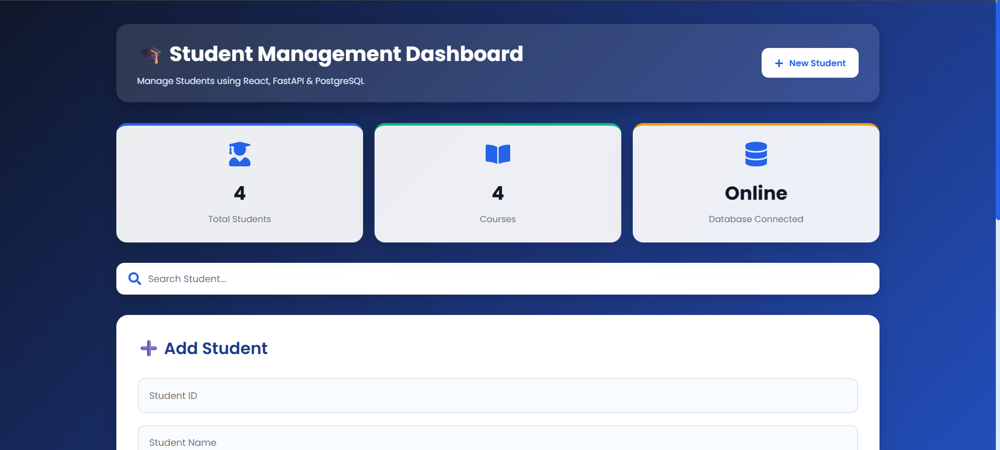
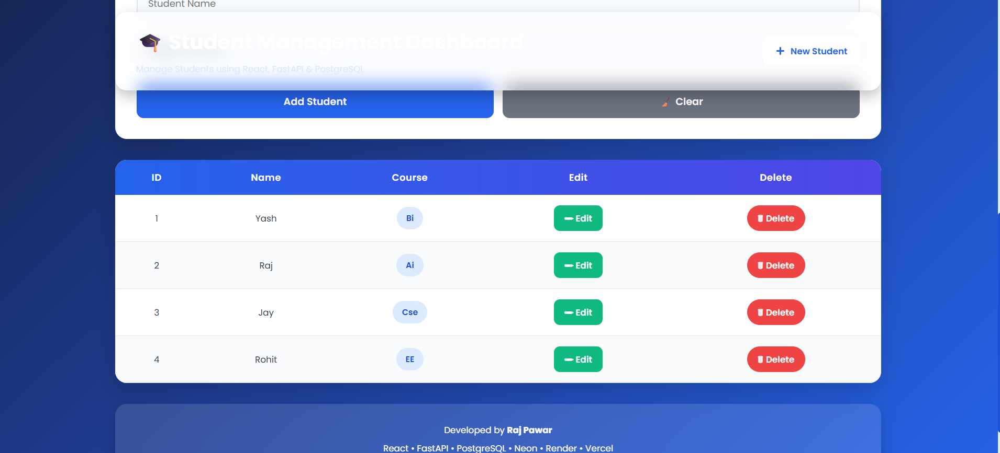

# 🎓 Student Management Dashboard

A modern **Full-Stack Student Management Dashboard** built using **React**, **FastAPI**, and **PostgreSQL**. The application provides complete CRUD (Create, Read, Update, Delete) functionality through a responsive and user-friendly dashboard interface.

---

## 🚀 Live Demo

**🌐 Frontend**  
https://student-management-system-rouge-chi.vercel.app/

**⚙️ Backend API**  
https://student-management-system-weq7.onrender.com/

**📚 API Documentation (Swagger)**  
https://student-management-system-weq7.onrender.com/docs

**💻 GitHub Repository**  
https://github.com/rajpawarkk11/Student-Management-System

---

## 📸 Project Screenshots

### Dashboard



### Student Records



---

## ✨ Features

- ➕ Add New Student
- 📋 View Student Records
- ✏️ Update Student Details
- 🗑️ Delete Student
- 🔍 Live Search Functionality
- 📊 Dashboard Statistics
- 🔔 Toast Notifications
- 📱 Responsive User Interface
- ☁️ PostgreSQL Cloud Database
- 🌐 REST API Integration
- 🚀 Fully Deployed Application

---

## 🛠️ Tech Stack

### Frontend
- React.js
- Vite
- Axios
- CSS3
- React Icons
- React Hot Toast

### Backend
- FastAPI
- Python
- Psycopg2

### Database
- PostgreSQL (Neon)

### Deployment
- Vercel
- Render

---

## 📂 Project Structure

```text
Student-Management-System
│
├── backend/
│   ├── main.py
│   ├── requirements.txt
│   └── ...
│
├── frontend/
│   ├── public/
│   ├── src/
│   ├── package.json
│   └── ...
│
├── Screenshots/
│   ├── dashboard.png
│   └── dashboard-table.png
│
└── README.md
```

---

## ⚙️ Installation

### Clone the Repository

```bash
git clone https://github.com/rajpawarkk11/Student-Management-System.git
```

### Frontend Setup

```bash
cd frontend

npm install

npm run dev
```

### Backend Setup

```bash
cd backend

python -m venv venv

venv\Scripts\activate

pip install -r requirements.txt

uvicorn main:app --reload
```

---

## 🌐 REST API Endpoints

| Method | Endpoint | Description |
|---------|----------|-------------|
| GET | `/students` | Fetch all students |
| GET | `/students/{id}` | Fetch a student by ID |
| POST | `/students` | Add a new student |
| PUT | `/students/{id}` | Update student details |
| DELETE | `/students/{id}` | Delete a student |

---

## 👨‍💻 Developer

**Raj Pawar**

**GitHub**  
https://github.com/rajpawarkk11

**LinkedIn**  
https://www.linkedin.com/in/raj-pawar-521a2b290

---

## 📄 License

This project is developed for educational, learning, and portfolio purposes.
